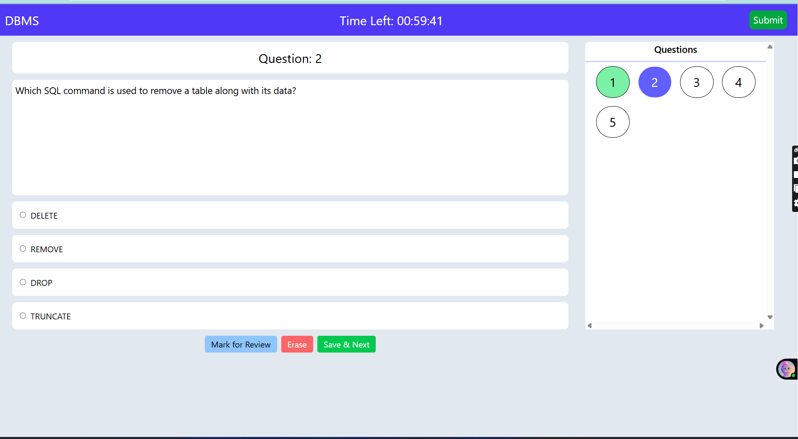
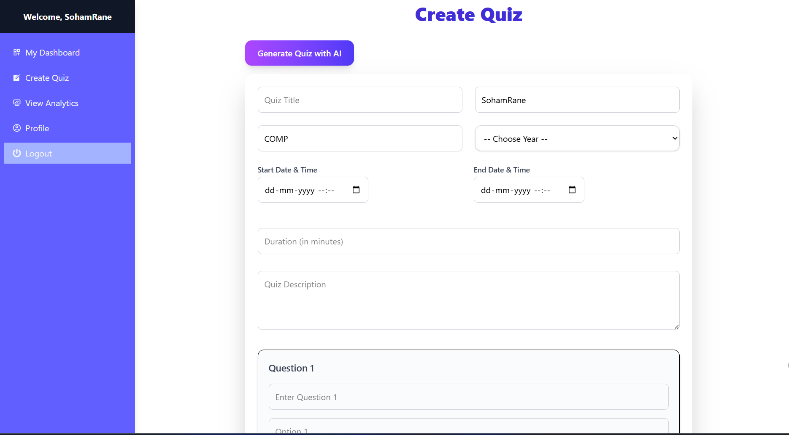
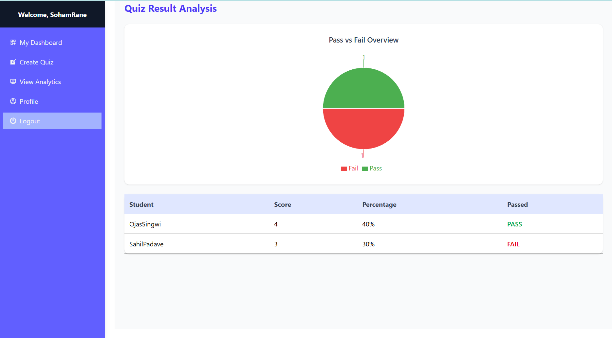
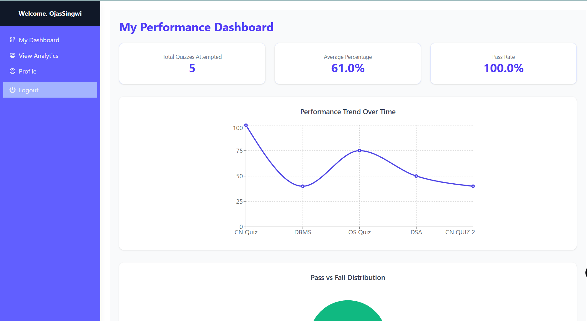

<h1 align="center"> Quiz App – Full Stack Web Application</h1>

<p align="center">
  <b>AI-Powered • Real-Time • Interactive Quiz Management System</b>
</p>

###  Dashboard
<p align="center">
  
</p>

###  Quiz Attempt Page
<p align="center">
  
</p>

###  Create Quiz page
<p align="center">
  
</p>

###  Faculty Analytics
<p align="center">
  
</p>

###  Student Analytics
<p align="center">
  
</p>

<p align="center">
  <b>A full-stack web application built to streamline and digitalize quiz management in educational institutions.</b>
</p>

---

## 🚀 Overview

The **Quiz App** is a full-stack web application that **digitalizes the quiz management process** for colleges and schools.  
It offers a secure, automated, and interactive platform for **faculty** to create and manage quizzes, and for **students** to attempt them in a real exam-like environment — complete with **AI-powered quiz generation**, **real-time evaluation**, and **analytics dashboards**.

---

## 🧩 Tech Stack

| Layer | Technology | Description |
|--------|-------------|--------------|
| **Frontend** | [React.js](https://reactjs.org/) | Dynamic, component-based user interface |
| **Styling** | [TailwindCSS](https://tailwindcss.com/) | Utility-first responsive CSS framework |
| **Animations** | [Framer Motion](https://www.framer.com/motion/) | Smooth, modern animations and transitions |
| **Charts & Analytics** | [Recharts](https://recharts.org/) | Data visualization for student performance analytics |
| **Backend** | [Django](https://www.djangoproject.com/) | Robust backend framework for quiz logic and management |
| **API Layer** | [Django REST Framework (DRF)](https://www.django-rest-framework.org/) | RESTful API for frontend-backend communication |
| **Database** | [MySQL](https://www.mysql.com/) | Relational database for structured quiz data |
| **Authentication** | [JWT (JSON Web Tokens)](https://jwt.io/) | Secure authentication for faculty & students |
| **AI Integration** | [Google Gemini API](https://ai.google.dev/) | Auto-generates quiz questions based on syllabus/topics |
| **Email Service** | [Django Email System](https://docs.djangoproject.com/en/stable/topics/email/) | Sends quiz creation  |


---
## 🌟 Core Features

### 🧑‍🏫 Faculty Module
- Create, update, and delete quizzes easily  
- Assign quizzes to departments (COMP, IT, MECH, etc.) and specific years  
- Manage scheduling: set start time, end time, and duration  
- **AI-powered Quiz Generation** using Gemini API — auto-generates quiz questions  
- Automatic email notifications to students upon quiz creation or result publication  

### 🎓 Student Module
- Attempt quizzes in a **real exam-like environment**  
- Features: **timer, save & next, mark for review, and navigation panel**  
- View **real-time results** immediately after submission  
- Receive **email alerts** for new quizzes and results  
- Department & Year-based quiz filtering  

### 📊 Analytics & Dashboard
- Interactive analytics with **Recharts**  
- View quiz participation, performance metrics, and question difficulty trends  
- Faculty dashboards display **student performance insights**  
- Department-wise **leaderboards** and achievement tracking  

### 🔒 Authentication & Access Control
- Role-based access for **Admin**, **Faculty**, and **Students**  
- Secure authentication with **JWT tokens**  
- Faculty-only permissions for quiz creation and result access  

### ✉️ Automated Email Notifications
- Quiz creation and scheduling notifications to all eligible students  
- Result announcement alerts  
- HTML-styled emails using Django templates (Indigo theme)  

---

## 🧠 Advanced Features Implemented

| Feature | Description |
|----------|-------------|
| 🤖 **AI Quiz Generator** | Uses **Gemini API** to create quizzes automatically from topics or syllabus |
| 📧 **Email Notifications** | Auto-sends emails to students upon quiz creation and result generation |
| 📊 **Analytics Dashboard** | Recharts-based visual analytics for performance and participation tracking |
| 🏆 **Leaderboard System** | Department-wise and global leaderboards to encourage healthy competition |

---

## 🚀 Highlights

- **Full-stack React + Django REST** architecture  
- **Responsive design** using **TailwindCSS**  
- **Faculty-first UX** for quiz management  
- **Student-focused experience** with instant grading  
- **Gemini AI-powered automation** for faster quiz creation  
- **Integrated analytics** for performance tracking  

---

## 🧰 Project Setup

Follow the steps below to set up and run the project locally.

---

## 🧩 1️⃣ Clone the Repository

### 🔹 Step 1 — Clone
```bash
git clone https://github.com/Chinmay48/Quiz-App.git
cd quiz-app
```
---
### ⚙️ 2️⃣ Frontend Setup (React)
📍 Navigate to Frontend
```bash
cd Frontend
```
---

### 📦 Install Dependencies
```bash
npm install
```
---

### 📦 Create a .env file at (/Frontend)
Add your Gemini API key here
```bash
VITE_GEMINI_API_KEY=your_gemeini_api_key
```

---

### 🚀 Run the App
The React app will start at:
📍 http://localhost:5173/
```bash
npm run dev
```

---

### 🐍 3️⃣ Backend Setup (Django + MySQL)
📍 Navigate to Backend
```bash
cd ../Backend
```
---

### 🧰 Create Virtual Environment (Windows)
```bash
python -m venv venv
venv\Scripts\activate
```
> 💡 On macOS/Linux, use:
> ```bash
>python3 -m venv venv
>source venv/bin/activate
> ```
---

### 📦 Install Requirements
```bash
pip install -r requirements.txt

```

---


### 🗄️ Database Setup (MySQL)
⚙️ Step 1 — Create Database in MySQL
```bash
Open MySQL shell or any MySQL client and run:
```sql
CREATE DATABASE quiz_app;
```
---
⚙️ Step 2 — Update settings.py in Backend
In your Backend/core/settings.py, configure your MySQL database like this 👇
(Replace your_username and your_password with your MySQL credentials)
```bash
DATABASES = {
    'default': {
        'ENGINE': 'django.db.backends.mysql',
        'NAME': 'quiz_app',
        'USER': 'your_username',
        'PASSWORD': 'your_password',
        'HOST': 'localhost',
        'PORT': '3306',
    }
}
```
---
### ⚙️ Make Migrations
```bash
python manage.py makemigrations
python manage.py migrate

```
---
### Create Superuser (for Admin Login)
```bash
python manage.py createsuperuser

```
---
### 📦 Create a .env file at (/Backend)
Add your Email Host user and password here
```bash
EMAIL_HOST_USER = your_email@gmail.com
EMAIL_HOST_PASSWORD = your_password (abcd abcd abcd abcd)
```

---

### ▶️ Run the Django Server
The backend will run at:
📍 http://127.0.0.1:8000/
```bash
python manage.py runserver

```
---
